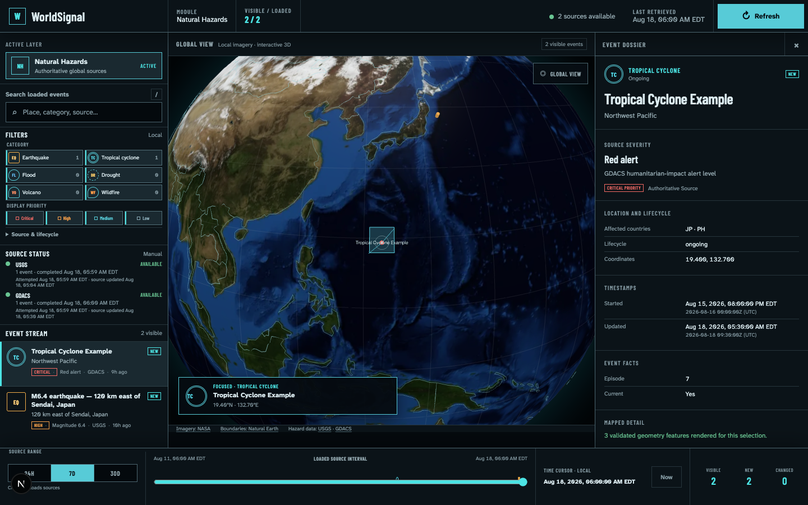

# Priority Signals

Priority Signals is an open-source, local-first security operations platform for protecting
important people from physical and digital threats. The current application contains four connected
operational views:

- **Home** — the shared people roster, approved locations, and confirmed travel state.
- **WorldSignal** — global natural-hazard awareness on an interactive 3D globe.
- **FlightSignal** — assigned-flight awareness using AirLabs itinerary and aircraft observations
  with explicit operator confirmation of traveler presence.
- **CredSignal** — credential-exposure intelligence, protectee attribution, and response
  coordination backed by local PostgreSQL.

Use the product switcher in the application header to move between modules.

> Priority Signals is not an official emergency-warning service, airline operational system,
> passenger locator, credential-vault product, breach feed, or notification-delivery service.
> WorldSignal and FlightSignal source data can be delayed or revised.
> CredSignal currently uses manual intake and has no authentication or authorization enforcement.
> Do not expose this MVP to an untrusted network or load real sensitive data into it.



## Current capabilities

### WorldSignal

- Retrieves global M4.5+ earthquakes from the U.S. Geological Survey (USGS).
- Retrieves GDACS tropical cyclones, floods, droughts, volcanoes, and significant forest fires,
  including paginated results.
- Retrieves U.S. preliminary observed tornado reports from NOAA's Storm Prediction Center (SPC)
  filtered daily report files. Reports are clearly marked preliminary and may be revised.
- Makes no event request until an operator selects **Load current events** for an uncached range and
  never polls afterward.
- Normalizes both providers behind one validated event contract while retaining source-native
  severity and provenance.
- Keeps the globe, keyboard-accessible event stream, filters, timeline, selection, and dossier on
  one reducer-coordinated state model.
- Fetches validated GDACS paths and polygons only for the selected event.
- Stores the latest validated 24-hour, 7-day, and 30-day snapshots in the current browser so module
  switches, page reloads, browser restarts, and local server restarts do not recontact sources.
- Tracks new, updated, resolved, and unchanged events between successful manual retrievals and
  preserves the comparison baseline with each browser snapshot.
- Runs without an account, API key, commercial map token, analytics, or paid service.

WorldSignal remains its original MVP-A: incident signals, historical source-revision replay, alerts,
accounts, collaboration, and mobile-native applications are not implemented yet. Browser snapshots
retain the latest retrieved batch; they are not a historical event archive.

### FlightSignal

- Lets an analyst enter a passenger-facing flight ID, review the current dated AirLabs match, and
  assign it to a person. Assignment reuses a signed 15-minute lookup result and does not make a
  second provider request.
- Stores AirLabs schedule, estimate, status, terminal, gate, aircraft, and position fields in local
  PostgreSQL. Browsers read the database and never call AirLabs directly.
- Runs a quota-aware worker while the Compose stack is up: no polling before T-30, checks at T-30
  and T-15, then targets about 120 position observations over the scheduled flight duration.
- Stops after the provider reports a terminal landed or cancelled state, backs off after transient
  source failures, and pauses globally after authentication, expiration, or quota failures.
- Keeps flight identity, aircraft observations, and traveler presence as separate facts. An operator
  must explicitly confirm that the assigned person is onboard.
- Shows the live plane at the latest stored position, heading, altitude, ground speed, freshness,
  observed breadcrumb, and a distinct remaining route on the adjustable FlightSignal globe.
- Places a confirmed traveler into **Travel** mode in Home and shows a plane at the aircraft's last
  valid position. The operator-approved Home location remains unchanged.
- Treats an AirLabs landed state as a possible arrival; an operator must complete the travel
  assignment.

AirLabs identifies flights and aircraft, not passengers, and does not provide a passenger manifest.
The interface preserves this boundary: a plane represents a person only after **Confirm onboard**.
AirLabs does not provide a historical trail through this integration, so FlightSignal accumulates a
breadcrumb only from observations collected after assignment while the worker is running. Stale and
source-error states remain visible, and no flight is tracked until an operator assigns one.

### CredSignal

- Maintains a persistent protectee roster with monitoring tiers, statuses, approved identities,
  and operator-maintained location history.
- Accepts manual credential-exposure records with source, service, confidence, severity, notes, and
  optional full credential values.
- Encrypts stored credential values with AES-256-GCM, fingerprints them separately for deduplication,
  and records every reveal in the activity log.
- Matches exact approved identities automatically and routes unmatched findings to an analyst queue
  for explicit, reasoned attribution.
- Opens response cases with priority-based due dates and credential-specific default tasks.
- Supports case ownership, priority and due-date changes, assigned task creation/editing, controlled
  task lifecycles, and audited case transitions.
- Prevents case closure while response tasks remain active; dismissing a case cancels its unfinished
  tasks and updates linked exposure state atomically.
- Tracks manual victim coordination through draft, planned, sent, acknowledged, and failed states.
  These records document contact; the application does not send messages.
- Shows each active protectee at an approved operational location on the globe with aggregate
  unresolved credential risk.
- Preserves append-only operator activity for intake, matching, credential reveal, roster changes,
  case work, tasks, and communication transitions.

CredSignal is intentionally local and manual in this open-source MVP. The database contains role and
operator models for the future, but the interface currently uses a demo operator selector and does
not enforce authentication, permissions, workspace isolation at login, external breach-feed
ingestion, automated notification, or production key management.

## Prerequisites

- Git
- Docker Desktop, or Docker Engine with Docker Compose support
- A modern WebGL-capable desktop browser

Node.js, npm, and PostgreSQL do not need to be installed on the host computer. The container image
provides Node.js 24 and installs the exact dependency tree from `package-lock.json`.

Confirm the required tools:

```bash
git --version
docker --version
docker compose version
```

## Initial local setup

Complete these steps once after cloning the repository.

### 1. Clone the repository

```bash
git clone https://github.com/Spec700/WorldSignal.git
cd WorldSignal
```

### 2. Configure AirLabs for FlightSignal

Create `.env` from `.env.example` and add the AirLabs server key. Keep this file local; Git ignores
it, and the key is passed only to the Next.js server and FlightSignal worker.

```bash
cp .env.example .env
```

```dotenv
AIRLABS_API_KEY=replace-with-your-airlabs-key
```

An AirLabs key is optional for Home, WorldSignal, and CredSignal, but FlightSignal lookup and live
monitoring remain paused without it. The implementation is designed around the AirLabs free plan;
plan allowances and expiry are provider-controlled and should be checked in the AirLabs dashboard.

### 3. Build and start Priority Signals

```bash
docker compose up --build
```

That single command builds the Node.js 24 application image and starts the complete stack. Docker
Compose automatically:

- starts PostgreSQL and waits for it to become healthy;
- creates a persistent CredSignal encryption key on a fresh installation;
- applies every committed database migration;
- creates or updates the synthetic demonstration workspace; and
- starts the production Next.js server and FlightSignal polling worker only after bootstrap succeeds.

No host `npm install`, `npm run build`, migration command, or seed command is required for a fresh
Docker installation. `.env` is needed only when enabling FlightSignal or importing an existing
CredSignal encryption key.

Open [http://localhost:3000](http://localhost:3000). The root route opens Home;
[http://localhost:3000/flightsignal](http://localhost:3000/flightsignal) and
[http://localhost:3000/credsignal](http://localhost:3000/credsignal) open those modules directly.

### Existing CredSignal installations

If this computer already has CredSignal data created by the earlier host-native setup, leave its
existing `.env` in the repository for the first Docker startup. Bootstrap imports the existing
`CREDSIGNAL_DATA_KEY` into the persistent Docker key volume so those credential values remain
readable. After that startup succeeds, Compose reads the key from its volume and no longer requires
`.env`; retain a secure backup of the original key.

Bootstrap deliberately stops if it finds encrypted database records without either the persisted
Docker key or the original key in `.env`. It will not silently replace a missing key.

## Stop Priority Signals

If Compose is attached to the current terminal, press `Ctrl+C`. Then remove the stopped application,
bootstrap, PostgreSQL containers, and private network:

```bash
docker compose down
```

This preserves both named volumes: the PostgreSQL data and its matching CredSignal encryption key.
Do not add `--volumes` unless you intentionally want to permanently delete all local CredSignal data
and the key required to decrypt it.

## Start again after initial setup

When the application images already exist and the source has not changed, run:

```bash
docker compose up
```

After pulling code changes or editing application files, rebuild while starting:

```bash
docker compose up --build
```

Migrations and the idempotent seed run safely whenever the stack is recreated. Check status or
follow logs from another terminal with:

```bash
docker compose ps
docker compose logs --follow
```

## Synthetic data and secrets

The automatic bootstrap creates synthetic operators, protectees, identities, locations, credential
exposures, cases, tasks, communications, and activity. The `.example` and `.test` identities are not
real people or accounts. The seed is idempotent for the configured workspace.

Full credential values are encrypted before PostgreSQL storage and are never written to application
logs, URLs, or browser storage. Docker stores the generated encryption key separately from the
database and mounts it read-only into the application container. Encryption does not compensate for
the current lack of access control. Use synthetic values only until authentication, authorization,
deployment hardening, and managed key storage are implemented.

## Operator behavior

### WorldSignal retrieval

- The default source range is 7 days.
- Choosing a range before the first load changes the upcoming request but does not contact a source.
- Choosing a different range after a successful load restores that range's browser snapshot when one
  exists. An uncached range makes one explicit source request and is then stored.
- Reloading WorldSignal or switching between Priority Signals modules restores the last-used
  browser snapshot without a source request.
- **Refresh** is the only action that replaces a stored snapshot by retrieving that range again.
  There is no timer, polling loop, WebSocket, background worker, cron job, automatic expiration, or
  automatic retry.
- Browser snapshots are local to one browser profile and localhost origin. Clearing site data removes
  them; stopping or recreating the Docker Compose containers does not.
- A partial result retains successful source events and identifies every failed source.
- Category, display-priority, source, lifecycle, text, and timeline filters operate locally over the
  loaded batch.

Keyboard controls:

- `/` or `Cmd/Ctrl+K`: focus event search
- `R`: retrieve hazards again when focus is outside an editable control
- `Arrow Up` / `Arrow Down`: move between event rows
- `Enter` / `Space`: select the focused event row
- `Escape`: clear selection or close the active operational panel

Every globe event has an equivalent button in the event stream. Reduced-motion preferences remove
the retrieval sweep, selection pulse, and animated camera travel.

### FlightSignal operations

- Select **Track flight**, enter the passenger flight ID, and review the dated AirLabs match. The
  lookup consumes one interactive request; assigning the signed match consumes none.
- Select **Confirm onboard** only after verifying the traveler context independently. Home enters
  Travel mode only after this operator action.
- Treat **Possible arrival** as an aircraft observation, not proof that the traveler arrived. Use
  **Complete travel** after operational confirmation.
- Closing or cancelling travel never changes the person's approved Home location.

`AIRLABS_API_KEY` is required for FlightSignal. The app records request use in PostgreSQL, limits
automatic polling to 800 requests per UTC calendar month, and reserves the remaining 200 of the
assumed 1,000-request allowance for analyst lookups and manual refreshes. AirLabs-reported quota
values are shown when present. `FLIGHTSIGNAL_POLL_INTERVAL_MS` defaults to 30 seconds and controls
only how often the worker checks local due times; it is not the AirLabs request cadence. Manual
refresh has a one-minute cooldown.

Automatic request timing:

- More than 30 minutes before departure: no provider polling.
- From T-30 to departure: one request every 15 minutes without overshooting departure.
- In flight: `ceil(flight duration / 120)` rounded to whole minutes, with a one-minute minimum and
  ten-minute maximum (for example, 2h → 1m, 6h → 3m, 12h → 6m).
- Landed or cancelled: the detecting request is final and the schedule is cleared.
- Transient errors: exponential backoff; authentication, expiry, and quota errors pause AirLabs
  globally until the key/account is corrected or the quota cycle resets.

### CredSignal operations

- Add and maintain protectees before attributing findings to them.
- Use an approved identity for exact matching, or leave a finding unmatched for manual triage.
- Treat **Reveal and audit** as a sensitive operator action; the plaintext is cleared from the
  interface after 60 seconds.
- Move response tasks through the available lifecycle controls. Complete or cancel every task before
  closing its case.
- Record victim coordination only after contact occurs through an approved external channel.
- Locations are maintained by operators and are not live tracking or breach-source locations.

## Architecture

```text
Priority Signals
├── Home
│   shared people / approved locations / confirmed travel presence
├── WorldSignal
│   browser action
│       ├── validated Next.js source routes
│       │   ├── USGS adapter
│       │   ├── GDACS adapter + selected-event geometry
│       │   └── NOAA SPC preliminary tornado-report adapter
│       └── client reducer ── globe / stream / filters / dossier
│               └── validated browser-local range snapshots (IndexedDB)
├── FlightSignal
│   server-rendered console + audited Server Actions
│       ├── AirLabs-resolved dated itinerary + signed assignment confirmation
│       ├── persistent quota accounting + due-time polling worker
│       └── append-only observations + Home travel projection
└── CredSignal
    server-rendered dashboard + audited Server Actions
        └── domain validation and transactional workflows
            └── PostgreSQL via Drizzle ORM
                ├── protectees / identities / locations
                ├── sources / encrypted exposures / matches
                ├── response cases / tasks / communications
                └── append-only activity
```

WorldSignal's server boundary constructs approved upstream URLs, enforces timeouts and response-size
limits, validates raw payloads, and returns canonical application data. FlightSignal applies the
same bounded-source validation to AirLabs responses, persists quota and polling state, and requires
explicit operator confirmation before aircraft telemetry can represent a person. CredSignal
validates inputs at the action boundary and uses database transactions and row locks for multi-record
workflow changes such as matching, case closure, and task coordination.

## Modules and sources

| Module                                                    | Data source                                                                      | Request or intake scope                                           | Authentication                   |
| --------------------------------------------------------- | -------------------------------------------------------------------------------- | ----------------------------------------------------------------- | -------------------------------- |
| WorldSignal earthquakes                                   | [USGS Earthquake Hazards Program](https://earthquake.usgs.gov/earthquakes/feed/) | M4.5+ rolling 24H, 7D, or 30D GeoJSON feed                        | None                             |
| WorldSignal cyclone, flood, drought, volcano, forest fire | [GDACS](https://www.gdacs.org/gdacsapi/swagger/index.html)                       | `TC`, `FL`, `DR`, `VO`, `WF`; all alert levels; paginated         | None                             |
| WorldSignal tornadoes                                     | [NOAA Storm Prediction Center](https://www.spc.noaa.gov/climo/reports/)          | U.S. filtered preliminary reports for each 12Z–12Z convective day | None                             |
| FlightSignal itinerary and aircraft observations          | [AirLabs Flight API](https://airlabs.co/docs/)                                   | One assigned flight ID; schedule, status, aircraft, and position  | Server API key; free tier limits |
| FlightSignal airport coordinates                          | [`airport-data`](https://www.npmjs.com/package/airport-data)                     | Local IATA lookup; no runtime network request                     | None; Unlicense                  |
| CredSignal credential findings                            | Manual operator intake                                                           | Synthetic or locally obtained records entered by an operator      | Demo operator only; not enforced |

USGS exclusively owns the current WorldSignal earthquake category. WorldSignal does not request
GDACS earthquake records or attempt speculative cross-source event merging. “Authoritative source”
means a record arrived through a documented USGS, GDACS, or NOAA SPC adapter; it does not mean
Priority Signals independently verified every upstream fact. SPC tornado reports are preliminary
observations rather than forecasts or active warnings, cover the United States, and can change
during NOAA review.

## Verification

Run the deterministic formatting, lint, unit/integration, production-build, and type checks inside
the pinned Node.js 24 image:

```bash
docker build --target verification .
```

Unit and HTTP integration tests use committed sanitized fixtures. Playwright intercepts WorldSignal's
local API while exercising the real browser, WebGL renderer, local assets, and application state.
The optional Playwright browser suite still requires Node.js 24, npm, and stable Chrome on the host;
those tools are not required to build or run Priority Signals through Compose.

CredSignal's PostgreSQL integration suite is opt-in because it changes a disposable test workspace
in the local database. With the Compose stack running:

```bash
docker compose run --rm -e RUN_CREDSIGNAL_DB_TESTS=1 bootstrap npm test -- tests/integration/credsignal-workflows.test.ts
```

The suite creates a process-scoped workspace, verifies the complete persistence and workflow chain,
and removes that workspace afterward.

FlightSignal's opt-in PostgreSQL suite verifies assignment without a duplicate provider lookup,
quota accounting, due polling, observation persistence, onboard Travel mode, Home projection,
completion, and preservation of the approved location:

```bash
docker compose run --rm -e RUN_FLIGHTSIGNAL_DB_TESTS=1 bootstrap npm test -- --run tests/integration/flightsignal-workflows.test.ts
```

## Docker operations

```bash
docker compose up --build     # build and start the complete stack
docker compose up             # start existing images
docker compose ps             # show service and health status
docker compose logs --follow  # follow logs from every service
docker compose down           # stop while preserving data and key volumes
```

PostgreSQL is reachable only inside the private Compose network. Open its command-line client with:

```bash
docker compose exec postgres psql -U priority_signals -d priority_signals
```

To permanently delete all local CredSignal data and its encryption key, then create a clean stack:

```bash
docker compose down --volumes
docker compose up --build
```

`docker compose down --volumes` removes both named volumes. Do not run it if the database contains
anything you need to retain.

## Troubleshooting

### Docker cannot build or start the stack

Confirm Docker Desktop or Docker Engine is running, then inspect `docker compose ps --all` and
`docker compose logs`. The first build needs internet access to retrieve the pinned Node.js and
PostgreSQL base images and install the locked npm dependency tree.

### What is `node_modules`?

Docker-only startup does not create `node_modules` on the host. Dependencies are installed into an
image layer and remain inside Docker. A host `node_modules` directory appears only if someone
explicitly runs `npm install` for optional host-native contributor tooling; Git ignores it, and it
is not sent to production browsers.

### CredSignal says the local workspace is required

Run `docker compose ps --all` and `docker compose logs bootstrap`. The app does not start until
PostgreSQL is healthy and bootstrap has successfully migrated, keyed, and seeded the workspace.

### Existing credentials can no longer be revealed

Do not delete the `priority-signals-secrets` volume independently of the database. When migrating
data created before the Docker-only stack, restore the exact original `CREDSIGNAL_DATA_KEY` in
`.env` before the first startup. `CREDSIGNAL_KEY_VERSION` records key metadata but the MVP does not
yet provide a multi-key rotation system.

### Port 3000 is already in use

Stop the conflicting local process or change the app's host-side port in `compose.yaml`. PostgreSQL
is not published to the host and therefore does not occupy host port 5432.

### A WorldSignal source is unavailable

Read the per-source status in the left rail. Confirm outbound HTTPS access and use the explicit
**Refresh** action. Repeated schema errors can indicate an upstream contract change.

### A FlightSignal flight has no aircraft position

Confirm the dated AirLabs match and leave the Compose worker running. A scheduled flight may not
have an aircraft or position yet, and FlightSignal intentionally does not invent either. Check the
AirLabs status, next-check time, quota summary, and source error in the dossier. More than 30 minutes
before departure, the worker waits locally without making provider requests. The visible breadcrumb
contains only observations stored after assignment.

### AirLabs is paused

Check that `AIRLABS_API_KEY` is present in `.env`, then recreate the app and worker containers so
they receive the environment change. Authentication, key-expiry, and provider-quota errors pause all
AirLabs calls. Replacing the key clears that pause on the next lookup; a local quota pause clears at
the next UTC calendar month. The UI never exposes the key.

### The globe is blank

Enable WebGL or hardware acceleration and verify that local files under `public/textures` and
`public/data` are present. Investigation remains available through the accessible queue or stream.

### Playwright cannot find Chrome

Install stable Google Chrome in the platform's normal application location and rerun
`npm run test:e2e`.

## Attribution and license

Visible in-app credits identify NASA Blue Marble imagery, Natural Earth boundaries, USGS earthquake
data, GDACS disaster data, NOAA SPC preliminary tornado reports, and AirLabs flight data. Fonts and
third-party software retain their licenses. See
[NOTICE.md](NOTICE.md) for source links, terms, and bundled-asset details.

Priority Signals source code is available under the [MIT License](LICENSE). Contributions should
preserve security and data-source boundaries, add deterministic tests for behavior changes, pass
the verification commands above, retain attribution, and avoid introducing real secrets or personal
data into fixtures.
